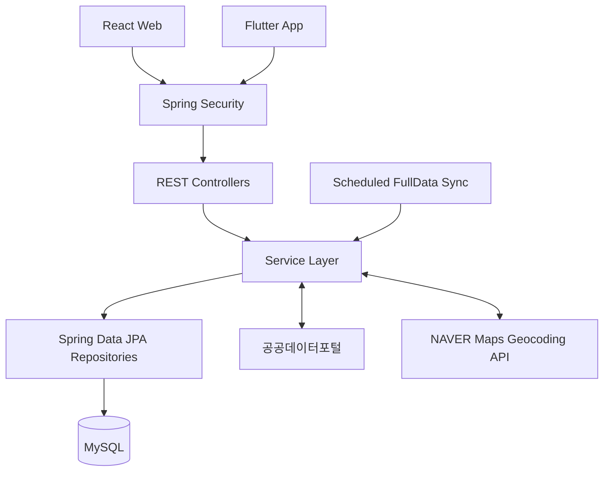

<div align="center">
  

  <h1>MediOn</h1>

  <p><strong>현재 위치 기반 의료기관 탐색 서비스</strong></p>
  <p>
    내 주변의 병원·약국·응급실을 검색하고,<br />
    운영 상태와 거리, 응급실 가용 병상을 한눈에 확인할 수 있는 서비스입니다.
  </p>
</div>

<div align="center">


</div>

## 서비스 소개

> "밤이나 휴일에 지금 진료 중인 병원은 어디일까?"
>
> "내 주변 약국과 응급실을 한 화면에서 비교할 수 없을까?"

필요한 의료기관을 급하게 찾아야 할 때 여러 서비스에서 위치, 운영시간과 진료 정보를 각각 확인해야 하는 불편함을 줄이기 위해 시작한 프로젝트입니다.

MediOn은 공공 의료데이터와 사용자 위치를 결합해 주변 의료기관을 거리순으로 제공하고, 지도와 목록을 연동해 탐색부터 상세 정보 확인까지 하나의 흐름으로 연결합니다. 하나의 Spring Boot REST API를 React 웹과 Flutter 앱이 함께 사용합니다.

### 핵심 가치

- **위치 중심 탐색**: GPS 현재 위치, 회원 저장 주소 또는 검색한 주소를 기준으로 주변 기관을 찾습니다.
- **상황에 맞는 검색**: 기관 유형, 진료과목, 운영 일정, 반경과 즐겨찾기 조건을 조합합니다.
- **안정적인 데이터 제공**: 공공 FullData를 내부 DB에 동기화해 조회 지연과 외부 API 의존도를 줄입니다.
- **일관된 사용자 경험**: 웹과 앱이 동일한 API와 검색 기준을 사용합니다.

> 의료기관 운영시간과 진료·수용 가능 여부는 실제 현장 상황과 다를 수 있습니다. 방문 또는 이동 전에 해당 기관이나 119 등 관계 기관에 직접 확인해 주세요.

## 주요 기능

| 기능 | 설명 |
| --- | --- |
| 위치 기반 검색 | GPS 현재 위치, 회원 저장 주소 또는 검색한 주소를 기준으로 반경 내 의료기관을 조회합니다. |
| 카테고리·상세 필터 | 병원·약국·응급실, 진료과목, 운영 일정, 현재 운영 여부와 즐겨찾기 조건을 제공합니다. |
| 지도·목록 연동 | OpenStreetMap 지도 마커와 거리순 검색 목록을 연동하고 기관 위치와 운영 상태를 표시합니다. |
| 의료기관 상세 정보 | 주소, 전화번호, 진료과목, 오늘 운영시간과 거리 정보를 확인할 수 있습니다. |
| 응급실 정보 | 주변 응급실을 검색하고 공공데이터 실시간 API를 통해 가용 병상을 보완합니다. |
| 회원·즐겨찾기 | Spring Security 세션 기반 회원가입·로그인과 사용자별 의료기관 즐겨찾기를 지원합니다. |
| 콘텐츠·문의 | 공지사항, 건강 정보, 이용 안내와 사용자 문의 등록·조회·삭제 기능을 제공합니다. |
| 개발자 대시보드 | 서비스 통계, 회원 현황, 동기화 이력, 공지사항과 문의를 관리합니다. |
| 정기 데이터 동기화 | 병원·진료과목·약국 FullData를 서버 시작 시점과 매일 오전 3시에 DB로 동기화합니다. |
| Flutter 앱 | Android와 Flutter Web에서 의료기관 검색, 회원 기능, 알림과 문의 기능을 제공합니다. |

## 서비스 이용 흐름


## 기술 스택

| 구분 | 기술 |
| --- | --- |
| Backend | Java 17, Spring Boot 3.3.5, Spring MVC |
| Security | Spring Security, Session Authentication, BCrypt |
| Data | Spring Data JPA, MySQL 8, Flyway |
| Web | React 18, TypeScript, Vite 5, Zustand |
| Web Map | Leaflet, React Leaflet, OpenStreetMap |
| App | Dart, Flutter, flutter_map, Geolocator, Local Notifications |
| External API | 공공데이터포털 의료기관 FullData·응급실 API, NAVER Maps Geocoding API |
| Build·Test | Gradle, JUnit 5, Mockito, Spring Security Test |

## 아키텍처



웹과 앱의 일반 요청은 Spring Security를 거쳐 Controller-Service-Repository 계층에서 처리합니다. 의료기관 검색은 MySQL의 저장 데이터를 기준으로 수행하며, 정기 동기화와 실시간 응급실 정보가 공공데이터를 보완합니다.

## 프로젝트 구조

```text
MediOn/
├── backend/   Spring Boot REST API, 데이터 동기화, 인증·관리 기능
├── frontend/  React 기반 웹 서비스와 개발자 대시보드
└── app/       Android 및 Flutter Web용 Flutter 앱
```

백엔드 패키지는 다음과 같이 구성됩니다.

```text
com.example.medicalsearch
├── client       공공데이터·NAVER Maps 외부 API 연동
├── config       Security, CORS, 설정과 개발자 계정 초기화
├── controller   REST API 엔드포인트
├── dto          요청·응답 모델
├── entity       JPA 엔티티와 enum
├── repository   Spring Data JPA 저장소
├── service      인증, 공지, 문의, 개발자 기능과 데이터 동기화
└── serviceImpl  의료기관 검색 구현
```

## 시작하기

### 1. 준비 사항

- JDK 17
- MySQL 8
- Node.js 18 이상
- Flutter SDK와 Dart 3.12.2 호환 환경
- 공공데이터포털 일반 인증키
- NAVER Cloud Platform Maps Geocoding API 키

Gradle은 Wrapper가 포함되어 있어 별도로 설치하지 않아도 됩니다.

### 2. 저장소 복제

```bash
git clone https://github.com/KwanEon/MediOn.git
cd MediOn
```

### 3. 데이터베이스 생성

```sql
CREATE DATABASE medical_search
  CHARACTER SET utf8mb4
  COLLATE utf8mb4_unicode_ci;
```

Flyway가 백엔드 시작 시 의료기관, 회원, 즐겨찾기, 공지와 문의 테이블을 자동으로 생성·마이그레이션합니다.

### 4. 애플리케이션 설정

저장소 루트에서 예시 파일을 복사합니다.

```powershell
Copy-Item backend/src/main/resources/application-secret.properties.example `
  backend/src/main/resources/application-secret.properties
```

macOS 또는 Linux:

```bash
cp backend/src/main/resources/application-secret.properties.example \
  backend/src/main/resources/application-secret.properties
```

생성한 `application-secret.properties`에 실제 값을 입력합니다.

```properties
spring.datasource.url=jdbc:mysql://localhost:3306/medical_search?serverTimezone=Asia/Seoul&characterEncoding=UTF-8
spring.datasource.username=root
spring.datasource.password=change-me

app.public-data.service-key=your-data-go-kr-service-key
app.naver-maps.api-key-id=your-naver-maps-api-key-id
app.naver-maps.api-key=your-naver-maps-api-key
```

`application-secret.properties`는 Git에서 제외됩니다. 실제 비밀번호나 API 키를 `application.properties` 또는 커밋할 파일에 넣지 마세요.

### 5. 백엔드 실행

Windows:

```powershell
cd backend
.\gradlew.bat bootRun
```

macOS 또는 Linux:

```bash
cd backend
./gradlew bootRun
```

백엔드는 기본적으로 `http://localhost:8080`에서 실행됩니다.

### 6. 웹 실행

```bash
cd frontend
npm ci
npm run dev
```

웹 개발 서버는 `http://localhost:5173`에서 실행되며 `/api` 요청을 `http://localhost:8080`으로 프록시합니다.

### 7. Flutter 앱 실행

```bash
cd app
flutter pub get
flutter run
```

기본 API 주소는 실행 환경에 따라 다음과 같습니다.

| 실행 환경 | 기본 API 주소 |
| --- | --- |
| Android 에뮬레이터 | `http://10.0.2.2:8080` |
| Flutter Web·데스크톱 | `http://localhost:8080` |

실기기나 별도 서버에 연결할 때는 빌드 시 주소를 지정합니다.

```bash
flutter run --dart-define=API_BASE_URL=http://192.168.0.10:8080
```

## 개발자 계정

로컬 개발 환경에서는 백엔드 시작 시 아래 개발자 계정을 생성하거나 기존 계정을 개발자 권한으로 맞춥니다.

```text
아이디: admin
비밀번호: 12341234
```

이 계정은 개발 편의를 위한 기본값입니다. 배포 환경에서는 반드시 환경 변수로 비밀번호를 변경하거나 계정 자동 생성을 비활성화하세요.

| 환경 변수 | 기본값 | 설명 |
| --- | --- | --- |
| `MEDION_DEVELOPER_ACCOUNT_ENABLED` | `true` | 개발자 계정 자동 생성 여부 |
| `MEDION_DEVELOPER_USERNAME` | `admin` | 개발자 계정 아이디 |
| `MEDION_DEVELOPER_PASSWORD` | `12341234` | 개발자 계정 비밀번호 |

웹에서 개발자 계정으로 로그인하면 헤더의 `개발자 대시보드` 버튼을 통해 `/developer`로 이동할 수 있습니다.

## 공공데이터 동기화

- 병원·진료과목과 약국 데이터는 기본적으로 서버 시작 시 및 매일 오전 3시에 동기화됩니다.
- HPID를 기준으로 기관을 갱신하고, 완료된 전체 동기화에서만 미수신 기관과 오래된 진료과 관계를 정리합니다.
- 수집 도중 FullData 전체 건수가 변경되면 첫 페이지부터 다시 수집하여 하나의 안정된 스냅샷을 저장합니다.
- API 요청 한도나 외부 장애가 발생하면 기존 데이터를 유지하고 다음 동기화에서 재시도합니다.
- 개발자 대시보드에서 병원 또는 약국 동기화를 수동으로 요청할 수 있습니다.
- 응급실 가용 병상은 검색 시 공공데이터 실시간 API로 보완합니다.

동기화 동작은 환경 변수로 조정할 수 있습니다.

| 환경 변수 | 기본값 |
| --- | --- |
| `PUBLIC_DATA_ENABLED` | `true` |
| `DATA_GO_KR_SYNC_ON_STARTUP` | `true` |
| `DATA_GO_KR_SYNC_CRON` | `0 0 3 * * *` |
| `DATA_GO_KR_SYNC_PAGE_SIZE` | `1000` |
| `DATA_GO_KR_TIMEOUT` | `20s` |

## 주요 화면 경로

| 경로 | 설명 |
| --- | --- |
| `/` | 위치 기반 의료기관 검색과 지도 |
| `/institutions` | 병원·약국·응급실 통합 검색 |
| `/emergency` | 주변 응급실 검색 |
| `/health/departments` | 진료과목 안내와 검색 |
| `/notices` | 공지사항 |
| `/guide` | 서비스 이용 안내 |
| `/inquiry` | 사용자 문의 등록과 내역 |
| `/profile` | 회원정보 관리 |
| `/developer` | 개발자 대시보드 |

## 주요 API

| 구분 | 엔드포인트 |
| --- | --- |
| 인증·회원정보 | `/api/v1/auth` |
| 주변 의료기관·응급실 병상 | `/api/v1/institutions` |
| 즐겨찾기 | `/api/v1/favorites` |
| 공지사항 | `/api/v1/notices` |
| 사용자 문의 | `/api/v1/inquiries` |
| 개발자 대시보드 | `/api/v1/developer` |

주변 의료기관 검색 예시:

```http
GET /api/v1/institutions/nearby?lat=37.5665&lng=126.9780&radiusMeters=3000&types=HOSPITAL,PHARMACY&page=0&size=30
```

## 검증

백엔드 테스트:

```powershell
cd backend
.\gradlew.bat test
```

웹 프로덕션 빌드:

```bash
cd frontend
npm ci
npm run build
```

Flutter 정적 분석과 테스트:

```bash
cd app
flutter analyze
flutter test
```

<div align="center">
  <strong>필요한 순간, 내 주변의 의료기관을 더 빠르고 정확하게 찾아보세요.</strong>
</div>
